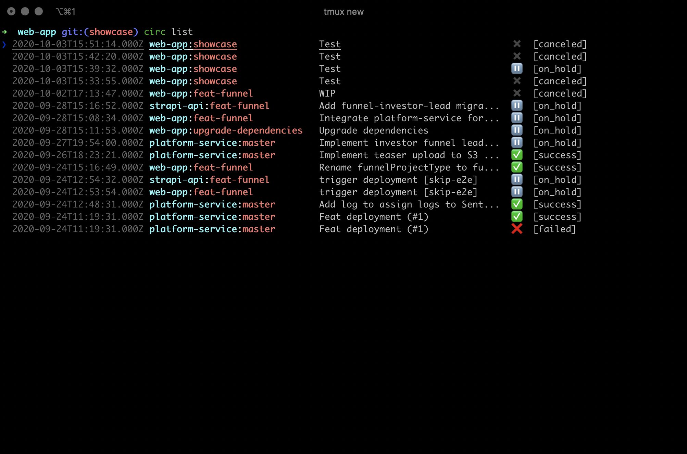

# circ 🔄

circ is a CLI for interacting with CircleCI during tests, builds and deployments without leaving your
terminal.

## 1) Viewing triggered workflow after pushing latest changes

Just type `circ` from within your local repository directory to view the status
of the CircleCI workflow that matches your latest git commit hash:


## 2) Viewing a list of the latest workflows

Type `circ list` to see the latest workflows of projects you are subscribed to on
CircleCI. Navigate with ⬆️/⬇️ and select the workflow you want to view:



## Installation

Currently, only MacOS is officially supported.
```
brew tap tobiastrinks/circ
brew install circ
```
or using npm
```
npm install -g @ttrinks/circ
```

## License (MIT)

Copyright 2020 Tobias Trinks

Permission is hereby granted, free of charge, to any person obtaining a copy of this software and associated documentation files (the "Software"), to deal in the Software without restriction, including without limitation the rights to use, copy, modify, merge, publish, distribute, sublicense, and/or sell copies of the Software, and to permit persons to whom the Software is furnished to do so, subject to the following conditions:

The above copyright notice and this permission notice shall be included in all copies or substantial portions of the Software.

THE SOFTWARE IS PROVIDED "AS IS", WITHOUT WARRANTY OF ANY KIND, EXPRESS OR IMPLIED, INCLUDING BUT NOT LIMITED TO THE WARRANTIES OF MERCHANTABILITY, FITNESS FOR A PARTICULAR PURPOSE AND NONINFRINGEMENT. IN NO EVENT SHALL THE AUTHORS OR COPYRIGHT HOLDERS BE LIABLE FOR ANY CLAIM, DAMAGES OR OTHER LIABILITY, WHETHER IN AN ACTION OF CONTRACT, TORT OR OTHERWISE, ARISING FROM, OUT OF OR IN CONNECTION WITH THE SOFTWARE OR THE USE OR OTHER DEALINGS IN THE SOFTWARE.
